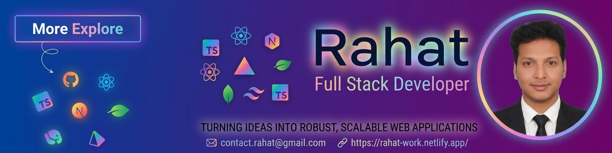

<!--- banner --->

 

<!--- title --->

  <ul align="center">
    
<h1 style="display: inline-block">Hi 👋, I'm Rahat</h1>

    <!--- typo --->
    
  </ul>

 

<!--- about --->
- 👋 Hi, I’m **[@rahatlab](https://github.com/rahatlab)**
- 🖥️ I’m currently working on **React.js, Next.js, Typescript and Redux** for frontend development.
- 🗄️ Using **Node.js, Express.js, MongoDB, Mongoose, PostgreSQL, and Prisma** for the backend.
- 🛠️ I’m currently learning **React Native, GraphQL, Docker and AWS**.
- 💬 Ask me about **Full-Stack (React, Next, Node, Express, MongoDB, PostgreSQL)**.
<!-- - 🌐 Explore My Portfolio **[rahatlab](https://rahatlab.vercel.app/)** and My **[Resume](https://drive.google.com/uc?export=download&id=15hKPeWqITR4Sa_OncoDhpUdaNgnLJhBO)** -->
<!-- - 📝 I regularly write articles on **[LinkedIn](https://linkedin.com/in/touhidur-zaman)** -->
- 📫 Feel free to reach me out **[Email](contract.rahat@gmail.com)**
  
 

<!--- socials --->
## <b> FOLLOW ME ON SOCIALS:</b>

  

    <!-- GitHub -->

<!-- Facebook -->

  

 

<!--- technology --->
##  <b> TECHNOLOGY STACK:</b>

### Languages:

### CSS Frameworks & Libraries:

### JavaScript Frameworks & Libraries:

### Database & Model:

### Deployment Platform:

### Design & Graphics:

### Tools & Technologies:

 

<!--- statistics --->
## <b> GITHUB STATISTICS & ANALYSIS:</b>

### Repository Stats & Streak:
  
| ------------- | ------------- |

 

<!--- random quote --->
##  <b> RANDOM DEV QUOTE:</b>
 

---

<!--- visit count --->

  

